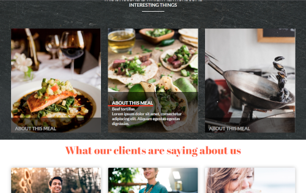

# Beyond CSS - Personal Chef Services

This is a solution to the "Personal Chef Services" challenge as part of Kevin Powell's "Beyond CSS" course.

## Table of Contents

-   [Overview](#overview)
    -   [The challenge](#the-challenge)
    -   [Screenshots](#screenshots)
-   [Issues](#issues)
-   [Links](#links)
-   [Built with](#built-with)
-   [What I learned](#what-i-learned)
-   [Author](#author)

## Overview

### The Challenge

This challenge is at the end (as of July 2022) of Module 3 of Kevin Powell's "Beyond CSS" course.
A Figma file was provided showing the required layout, including things like colours, images and sample text.

The Figma file only contained a layout for a desktop view, so I created my own mobile view based on that.

### Screenshots

#### Desktop views

Screenshot of the top of the desktop layout. The cursor is currently hovering over the 'Place order' button.
On a screen with no hover attribute, then this would indicate selection or focus of the button.

Lower down the page on the mobile layout. This image illustrates the use of different numbers of even columns with varying width containers.

Further down the page on the desktop layout. The cursor is currently hovering over the image of the beef tortilla wraps to reveal more 'About this meal'.
This is one place where I have deviated slightly from the Figma file (see [Issues](#issues) later)

#### Mobile views

Screenshot of the top of the mobile layout. The cursor is currently hovering over the 'More info' button.
On a screen with no hover attribute, then this would indicate selection or focus of the button.

Lower down the page on the mobile layout. The cursor is currently hovering over the image of the mussels to reveal more 'About this meal'. At the top of the screen you can see the 'About this meal' text from the previous meal.
On a screen with no hover attribute, then this information would be shown on all meal images at all times.

Mobile layout in landscape mode. The cursor is again hovering over the image of the mussels as in the previous screenshot. This layout on a small screen is less than ideal as the text covers most of the image.
Again, on a screen with no hover attribute, then this information would be shown on all meal images at all times, making it even less ideal.

This is less of a problem when viewed on a modern tablet, however.

## Issues

There were a number of issues I encountered and unilateral decisions I took during the project. In a real life project, these decisions would have been put to the client as suggestions for them to make a final decision as to their worth.

-   In the supplied Figma file it is unclear whether the two action buttons should have a different 'look', but I have worked on the assumption that the alternative button formatting is for the 'active' state.
-   There is no indicated hover state for the navigation links at the top of the display. I have given these links a darker orange highlight colour similar to the normal colour of the two action buttons.
-   The Figma file suggests that when the cursor is not hovering over one of the meal images then the 'About this meal' text block is completely hidden from the user. I left the 'About this meal' heading visible (but with reduced intensity) as an invitation to the user to hover over the image in search of more information.
-   Although not in the original design, in order to make the 'About this meal' information 'pop' a bit, I added an animated orange underline under the heading similar to one Kevin made on a YouTube video.
-   To make the site responsive, I chose to use variable font sizes as the ones specified would have been far too large on a mobile device.
-   In the final section, if the text of the three quotations is not of similar lengh then the heights of these cards would be uneven, resulting in a messy layout. Subgrid may solve this issue.

## Links

-   Solution URL: [Here](https://github.com/KelseyThornton/homecooked-meals)
-   Live Site URL: [Here](https://kelseythornton.nl/PersonalChef/)

## Built with

-   Semantic HTML5 markup
-   CSS custom properties
-   Flexbox
-   SASS
-   CSS Grid
-   Mobile-first workflow
-   Vite frontend environment
    <!-- - [React](https://reactjs.org/) - JS library -->
    <!-- - [Next.js](https://nextjs.org/) - React framework -->
    <!-- - [Styled Components](https://styled-components.com/) - For styles -->

## What I learned

After having worked with an NPM frontend environment based on [one described by Stephanie Eckles](https://thinkdobecreate.com/articles/minimum-static-site-sass-setup/), I found (and still find) Vite difficult to understand and tailor to my own wishes. The configuration is a bit of a 'black art' compared to what I was used to.

## Author

-   Website - [Kelsey Thornton](https://github.com/KelseyThornton)
